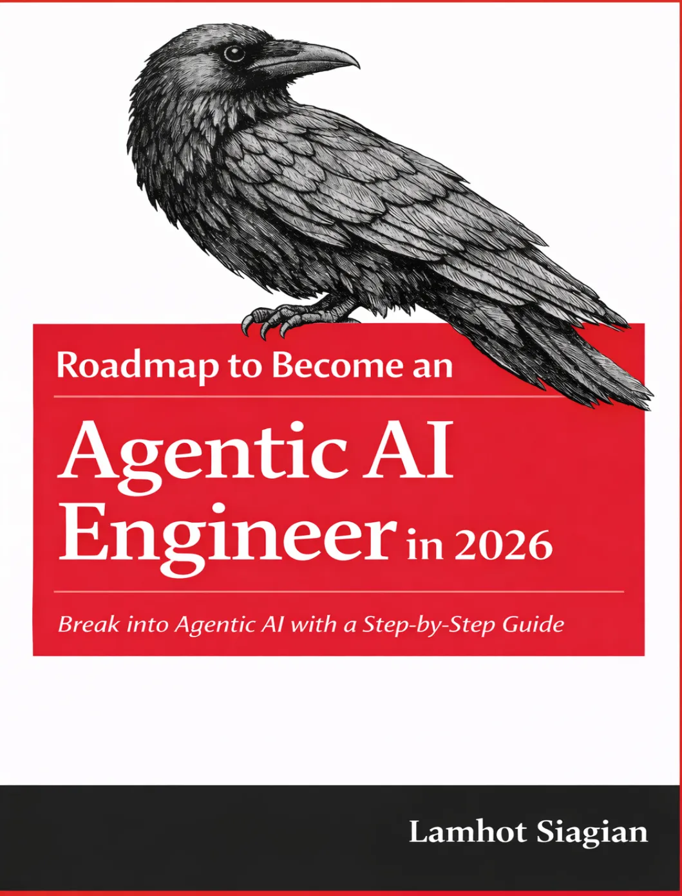
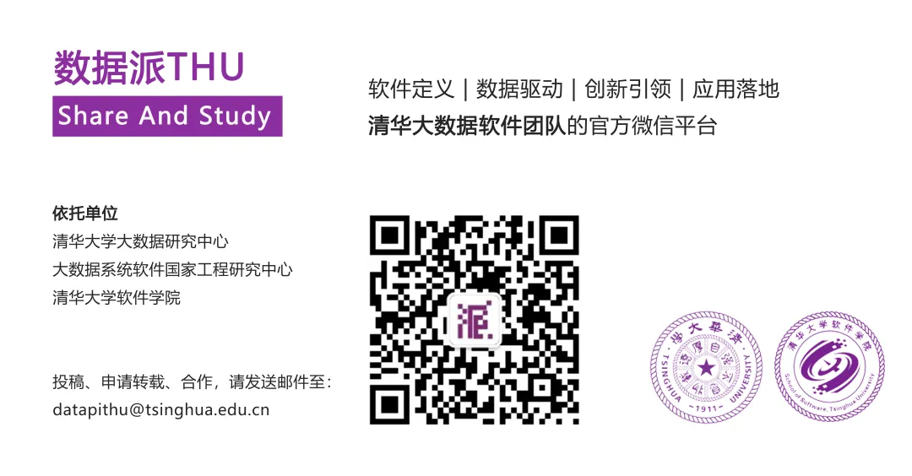

# [2026 年 Agentic AI 工程师完全指南：一份系统化的学习路线图](https://mp.weixin.qq.com/s/zDy-IuClbzPz_4K3yDe_pg)


```
来源：专知
本文约2000字，建议阅读5分钟
这份路线图不仅涵盖了从 Python 基础到生产部署的完整技术栈，更提供了大量实用的面试问答和工程心法。
```


2026 年 Agentic AI 工程师完全指南：一份系统化的学习路线图

随着大型语言模型从简单的对话工具演变为能够自主调用工具、检索知识、执行多步骤任务的“智能体”（Agent），一个全新的工程领域——Agentic AI 工程——正在迅速崛起。企业不再仅仅需要一个会聊天的模型，而是需要能够可靠地完成复杂业务任务的智能系统。

本文基于 Lamhot Siagian 博士撰写的**《Complete Roadmap to Become an Agentic AI Engineer in 2026》**，为想要进入这一领域的开发者梳理一条清晰、可执行的学习与实践路径。这份路线图不仅涵盖了从 Python 基础到生产部署的完整技术栈，更提供了大量实用的面试问答和工程心法。

## 路线图核心理念：基础先行，逐步强化

这份路线图强调“基础优先”的顺序：**先掌握核心编程与 LLM 概念，再学习框架，接着深入高级智能体架构，最后落脚于生产环境部署**。

作者提出的学习闭环非常值得借鉴：针对每个主题，先阅读问题，用自己的话重写答案，然后至少实现一个小型项目，最后记录下每一次失败与修复过程——这些真实的踩坑经历，恰恰是面试官最想听到的内容。

## 第一阶段：Python 工程基础——智能体的骨骼

为什么 Python 是 Agentic AI 的默认语言？不仅因为其丰富的生态（FastAPI、Pydantic、异步支持），更因为它能让你快速将原型固化为可测试、可维护的生产系统。

### 关键能力要点：

- **项目结构分层**：将入口、领域逻辑、智能体图、工具封装、RAG 模块、评估模块清晰分离，避免“意大利面条式”代码。
- **类型与验证**：善用 Pydantic 定义工具输入输出 Schema，这是防止模型产生幻觉参数的第一道防线。
- **同步与异步选择**：网络密集型工具调用适合`async`，CPU 密集型嵌入计算则需考虑后台任务队列。
- **配置管理与可复现性**：使用`uv`/`poetry`锁定依赖，通过环境变量管理密钥，这是生产环境稳定的基石。

## 第二阶段：LLM 基础——理解你的“大脑”

在进入炫酷的框架之前，必须深刻理解大模型的工作原理、局限与风险。

- **Token 与上下文预算**：Token 不仅是计费单位，更是决定记忆、检索和指令能装下多少内容的硬约束。优秀的工程师必须学会做“上下文预算”。
- **函数调用**：这是智能体区别于普通聊天机器人的核心机制，让模型输出结构化的操作指令而非自由文本，从而安全地连接现实世界。
- **提示工程是接口设计**：好的提示定义了角色、约束、输出格式和工具使用策略，需要像代码一样版本化并测试。
- **幻觉与注入防范**：在 RAG 和工具调用场景中，必须将检索内容视为“不可信数据源”，通过强制引用、Schema 验证和策略层来降低风险。

## 第三阶段：框架选择——工具是仆从，架构才是主人

面对 LangChain/LangGraph、CrewAI、AutoGen 等琳琅满目的框架，如何选择？

- **LangGraph 的生产级优势**：它将智能体行为建模为显式的状态图（节点、边、条件分支），极大提升了长流程任务的可观测性、可恢复性与可控性，避免了对话死循环。
- **警惕框架反模式**：最危险的陷阱是复制粘贴 Demo 代码，误把框架当作架构。**核心架构是你定义的状态模型、工具边界和安全规则**。
- **抽象与防锁定**：将 LLM 和向量库调用封装在接口层内，保持业务逻辑的独立性，以便未来平滑替换底层技术栈。

## 第四阶段：高级概念与记忆管理

当智能体开始处理跨天、跨会话的复杂任务时，基础链条就不够用了。

- **LCEL 与可运行单元**：通过声明式管道组合组件，使代码更模块化、可测试。
- **多智能体 vs 单智能体+工具**：引入规划者、检索者、执行者、评论者角色分工，能提升专业性，但也会增加协调开销。**只在任务确实需要分解时才走向多智能体**。
- **记忆的分层设计**：
 - **短期记忆**：对话窗口内的即时上下文。
 - **长期记忆**：外部向量库中的用户偏好、历史摘要。
 - **检查点**：保存工作流中间状态，是实现长时间运行任务恢复与人机协同的关键基础设施。

## 第五阶段：工具集成与 RAG 系统——连接世界的感官

- **智能体友好型工具设计**：工具应当命名清晰、目的单一、输入输出结构化、失败快速。对于有副作用的操作（发邮件、下单），必须设置确认闸门与权限检查。
- **RAG 的实用主义**：
 - **分块策略**：300-800 Token 的语义分块配合 10-20% 的重叠是常见起点，但必须通过评估不断调优。
 - **混合检索**：结合密集向量（语义）与稀疏检索（关键词 BM25），并通过重排序模型提升最终精度。
 - **元数据过滤**：这是企业级 RAG 的生命线，防止跨租户数据泄露，必须由代码强制执行而非依赖模型自觉。

## 第六阶段：真实项目构建与生产落地

一个能在本地跑通的脚本距离生产级应用还有巨大的鸿沟。路线图推荐的标准技术栈为：

- **后端 API**：FastAPI（异步、自动文档、强类型校验）。
- **前端演示**：Streamlit（快速构建聊天界面与调试面板）。
- **容器化**：Docker（非 root 用户、固定依赖、健康检查）。
- **云部署**：AWS ECS/Fargate 配合 RDS/向量数据库。
- **可观测性三件套**：结构化日志、分布式追踪、关键指标监控。必须具备通过 Trace ID 复现单次运行结果的能力。

## 2026 年学习检查清单与面试锦囊

这份路线图最后给出了一个精炼的 10 步学习清单：

**Python 根基**：类型、API、异步、测试。

**LLM 通识**：Token、上下文、提示、工具调用。

**框架启蒙**：从简入繁，再迁移至图式工作流。

**高阶工程**：组合、重试、降级、校验。

**记忆体系**：摘要 + 向量检索 + 检查点。

**工具工程**：Schema、安全闸门、观测。

**RAG 实战**：分块、混合检索、重排序、评估。

**智能体协作**：ReAct、监督者模式、协议。

**全栈项目**：FastAPI + UI + Docker + 云 + CI/CD + 评估。

**给面试者的特别建议**：带上 2-3 个具体的实战项目（哪怕规模不大），准备好讲述一个你亲手调试过的失败案例——比如检索噪音过大、工具调用超时、Schema 解析异常——并清晰地说明你是如何分析、定位并最终修复它的。这种解决真实问题的能力，正是区分熟练工与工程师的关键所在。

### 关于我们

数据派THU作为数据科学类公众号，背靠清华大学大数据研究中心，分享前沿数据科学与大数据技术创新研究动态、持续传播数据科学知识，努力建设数据人才聚集平台、打造中国大数据最强集团军。

### 

### 新浪微博：@数据派THU

**微信视频号：数据派THU**

**今日头条：数据派THU**