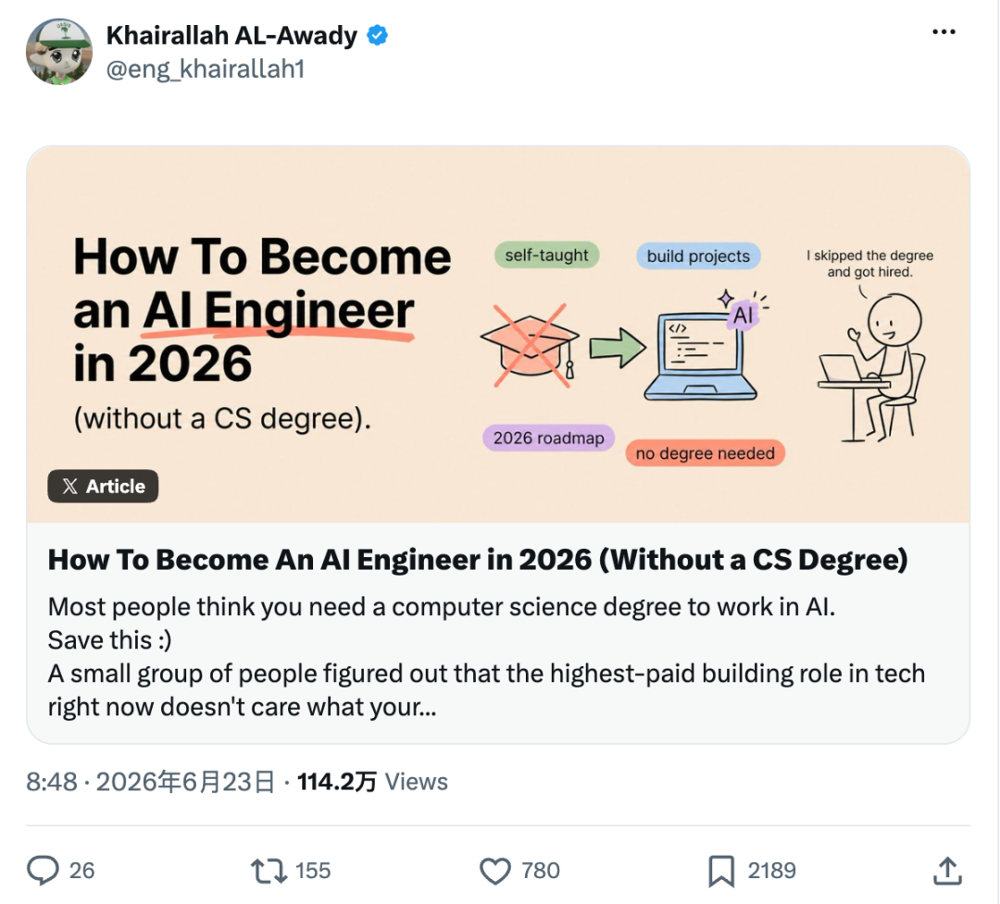
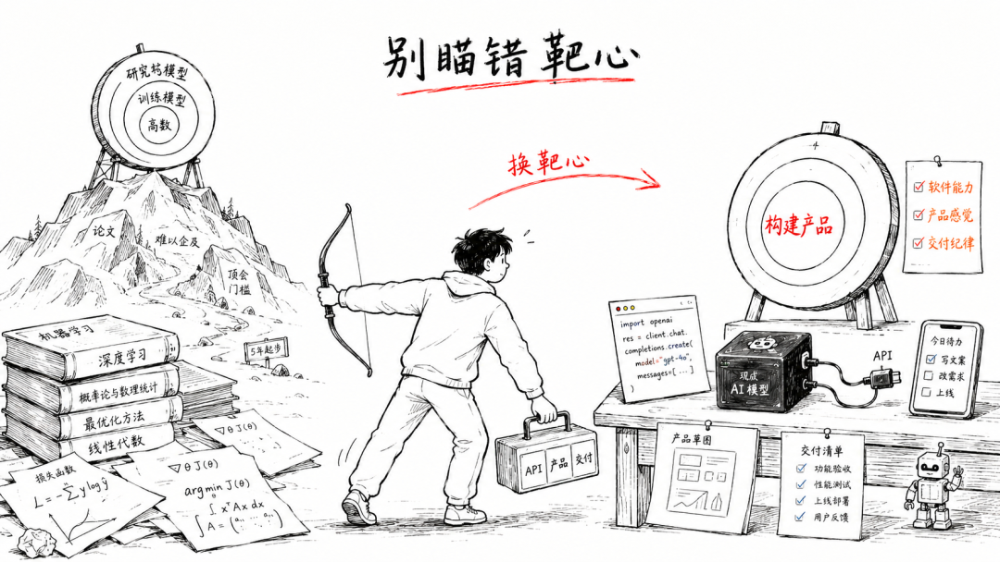
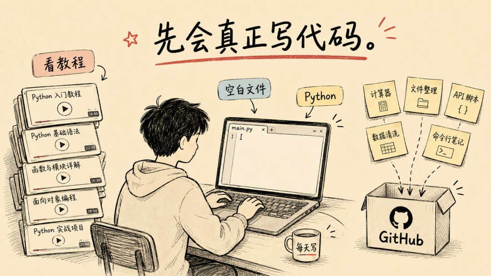
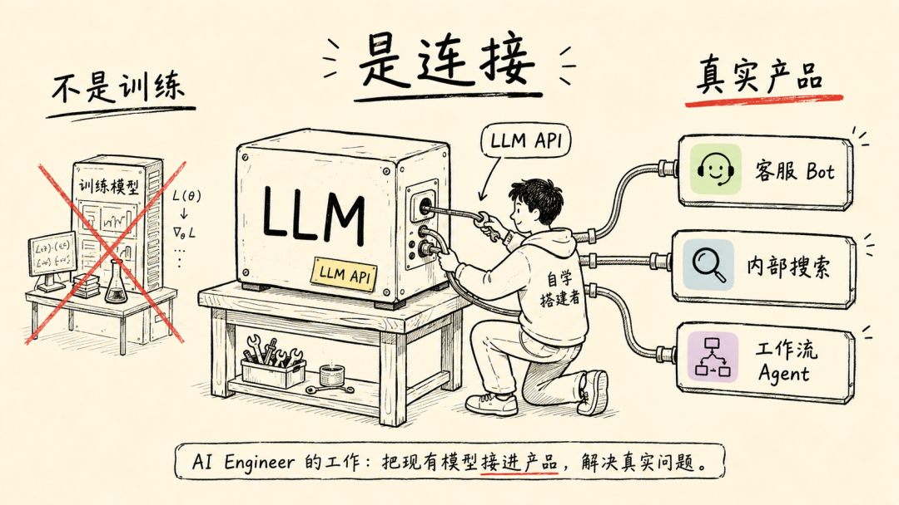
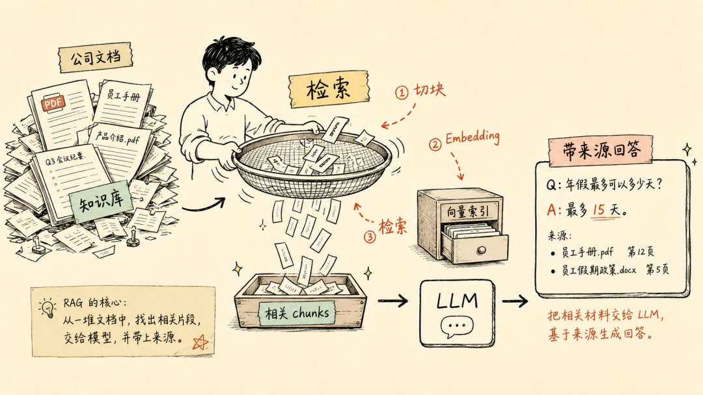
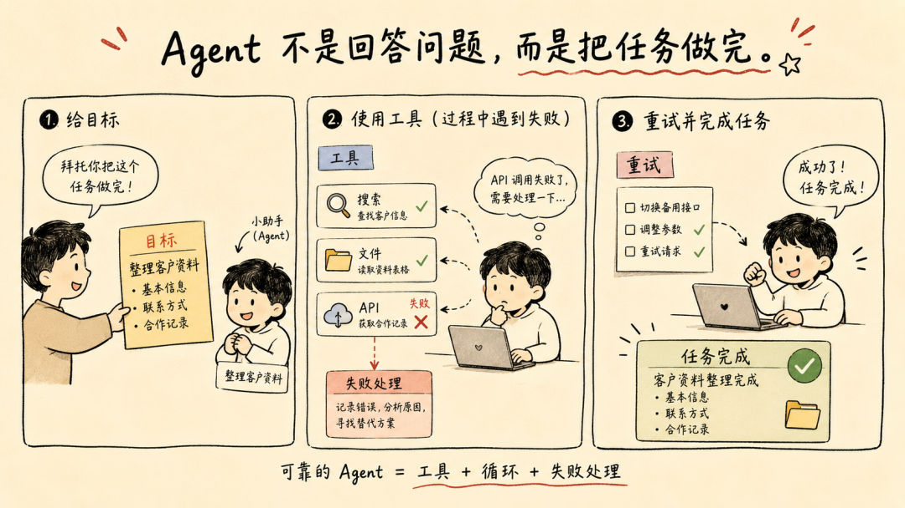
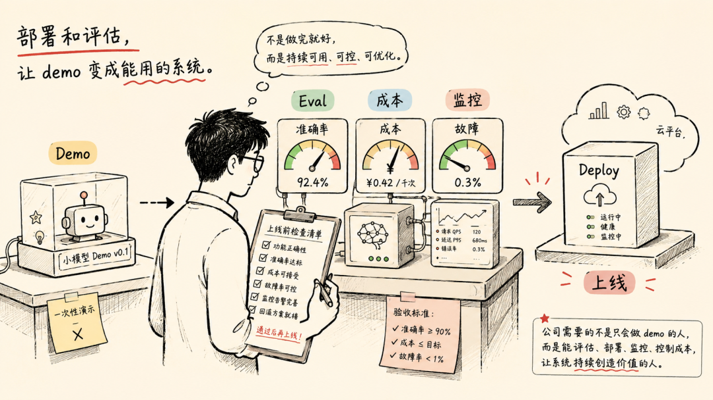
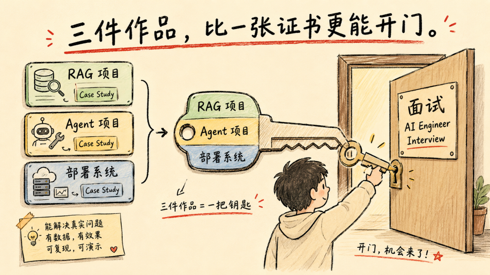
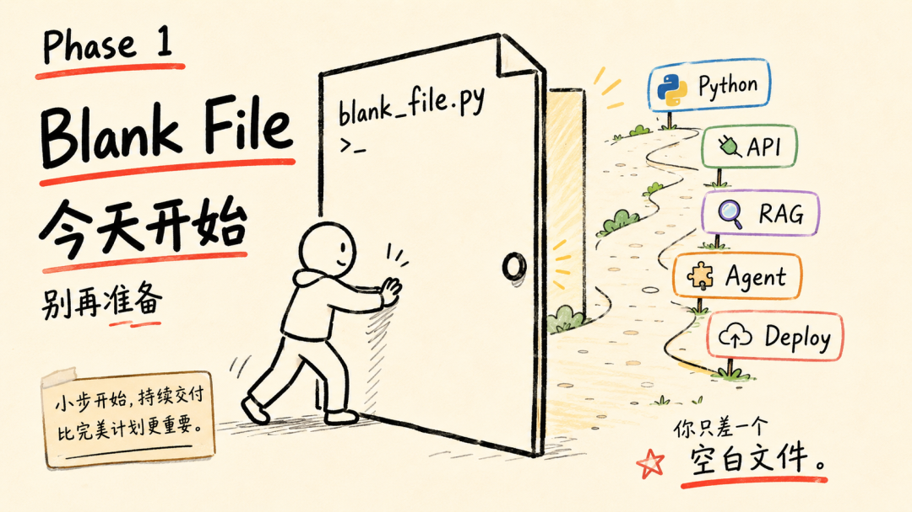

# [X 上百万爆文：没有 CS 学位，如何 12 个月拿到 AI 工程师的 Offer？](https://mp.weixin.qq.com/s/KWUbZEruNL7APp8koZg19Q)

这篇文章翻译并改写自 Khairallah AL-Awady 的《How To Become An AI Engineer in 2026 (Without a CS Degree)》，原文在 X 上获得了超过 100 万次浏览。

它回答一个问题：即使没有计算机科学学位，有没有一条 12 个月的路径，能让你从零走到拿到 AI 工程师的 offer？

有，原文作者写下六个阶段，需要三个作品集，以下是完整版。

## 先搞清楚这个岗位到底是什么

大多数人瞄准了错误的靶心。

机器学习研究员发明新模型、训练模型，需要高阶学位和大量数学，但只占市场一小块。AI 工程师拿已有模型构建产品，更看重软件能力、产品感觉和交付纪律。市面上绝大多数岗位——也是你不需要学位就能切入的——是第二种。

> 你要成为的是用 AI 构建产品的工程师，不是构建 AI 本身的科学家。

如果你现在正打算先去啃一本《机器学习》教材再动手——停，那不是你的入场券，那是研究者的入场券。

这个角色站在三样东西的交汇处：软件工程、对语言模型行为的实操理解、产品思维。不需要第一天三样都精通，你需要的是胜任且在进步，以及——证明。

## 第一阶段（第 1-3 月）：先把代码写顺

这是跳不过的步骤，也是大多数人试图跳过的步骤。

你必须能写出真正能跑的代码，其他一切才有意义。Python 是这门语言，几乎所有 AI 库和工具都先为 Python 构建，这不是偏好，是行业标准。

用这几个月让自己真正上手——不是"我看了教程"那种，是"从空白文件开始写小程序，不用查基本语法"那种。变量、数据类型、控制流、函数、文件操作、调用 API、处理错误、读别人的代码。从第一天起用 Git，把所有东西推到 GitHub——你的 GitHub 就是作品集的前半部分。

有开发经验的人，这个阶段快速过，直接进下一阶段。零基础别急，三个月值得。

数学焦虑？先放一放。你需要对基本统计有感觉就行，不需要先精通线性代数和微积分。深层数学对研究有用，你在做的是构建，项目需要时再补。

### 这个阶段做什么

- 完成一门系统 Python 课程，每天写代码，哪怕半小时
- 从零构建五个小程序：计算器、文件整理器、调用公开 API 的脚本、数据清洗工具、命令行笔记工具——它们分别练基础语法、文件操作、API 调用、数据处理、用户交互，刚好覆盖后续阶段最需要的五项基本功
- 学会 Git 基本操作，五个项目全部推到公开 GitHub
- 加入一个和你做同样事的社区，别在真空中学习

## 第二阶段（第 3-5 月）：拿下 LLM API

现在你接触定义这份工作的核心。

你在 ChatGPT 里打字，那是消费；你在代码里发一条请求、拿到结构化的 JSON、塞进你的业务流程，那是构建。区别就在这一步。AI 工程师通过 API 工作，当你在这里变得流畅，就从用户变成了构建者。

学会从脚本向模型发消息，处理流式响应、管理对话历史、控制输出格式、优雅地处理速率限制和错误。学会区分一个"还行"的 prompt 和一个每次都能给出精确、可重复、生产级答案的 prompt——在真实产品里，"通常正确"就是 bug。

国内开发者可用的 API 不止 OpenAI 一家。DeepSeek、通义千问、智谱 GLM 都提供稳定可用的 API 服务，注册门槛低，价格也有优势。选一个顺手的开始，切换成本不高。

这里还要学工具调用（Tool Use），也叫函数调用（Function Calling）——让模型采取行动：调用函数、查询系统、获取数据。理解了工具调用，Agent 的世界就打开了，因为 Agent 本质上就是带工具的模型加一个循环。

### 这个阶段做什么

- 拿到 API key，第一个小时内从 Python 脚本发出第一次调用
- 构建一个命令行工具：粘贴任意文本，让它做点有用的事
- 构建一个带记忆的聊天机器人，能记住对话前面的内容
- 实现工具调用：给模型一个它能调用的函数，让它正确地调用

## 第三阶段（第 5-7 月）：搭建 RAG 系统

这是让人拿到 offer 的技能——大多数 AI 产品底层都在做这件事。

RAG 全称检索增强生成，原理很简单：模型只知道训练时见过的和你喂给它的东西。RAG 就是从你自己的数据里找到正确的信息放到模型面前，让它对从未训练过的内容给出准确回答。公司内部文档、产品手册、知识库，都算。

你要学会把文档切成块，把块转成嵌入向量——就是把一段话变成一串数字，语义越接近的段落数字越接近，这样就能用数学方法找最相关的文档。存进向量数据库，检索最相关的块，喂给模型，得到有据可查的答案，而不是自信的猜测。

> 国内 RAG 落地场景明确：企业知识库、智能客服、金融合规、医疗病历检索、法律法条匹配。据 IDC 调研，**2026 年企业 AI 技术岗位中，要求掌握 RAG 的占比达 68%**。

端到端构建一个真正能用的 RAG 应用——真实文档、真实检索、真实评估——你就超过了大量只在嘴上聊 AI 的人。这是作品集项目一号。

### 这个阶段做什么

- 理解嵌入向量和向量数据库，先概念，后代码
- 用真实文档集构建 RAG 应用：你自己的笔记、一组 PDF、一个 wiki
- 加入检索评估：它找对了块，还是只找了"附近"的块？
- 部署到别人能用到的地方，哪怕是简单托管版本

## 第四阶段（第 7-9 月）：构建 Agent

现在你构建所有人都在谈论、但很少有人能真正交付的东西。

Agent 是一个能拿到目标、拆成步骤、用工具完成每一步、并根据结果决定下一步的模型。RAG 回答问题，Agent 完成任务。

你在第二阶段学了工具调用，现在把它放进带目标的循环里，给 Agent 多个工具，处理一个混乱现实——Agent 会原地打转、调错工具、卡住。构建可靠的 Agent，而不是 Demo 里看起来很炫的，正是市场最缺的技能。

> **说实话：Demo 级 Agent 容易，可靠 Agent 难。90% 的 Agentic RAG 项目在生产环境中失败。**差距在失败处理、工具设计和评估上——把精力花在这，因为这恰好把可雇用的工程师和有炫酷视频的人分开。

国内企业采纳 Agent 在加速——据沙丘智库数据，采纳率从 2024 年底的 17.3% 攀升到 2026 年中的 40.3%。但企业关心的是它能不能嵌入真实业务流程、稳定运行。

### 这个阶段做什么

- 构建一个使用多个工具完成真实多步骤任务的单 Agent 系统
- 构建一个小型多 Agent 系统，两个或多个 Agent 协作或互相检查
- 加入显式的失败处理：工具失败或返回空结果时，Agent 怎么办
- 让这成为作品集项目二号：一个解决真实问题的多 Agent 系统

## 第五阶段（第 9-11 月）：学会评估和部署

这是让你变得可雇用的无聊阶段，也是业余者跳过的阶段。

> 任何人都能让 AI 功能跑通一次。公司付钱让东西跑第一万次还能用。

评估：构建一套方法衡量系统好不好，一次改动是改善还是退化。对生成任务，量的是事实准确性、相关性、和参考答案的一致性——有时用另一个模型打分，有时用人工评审。会搭评估体系的工程师，是可以被信任交付生产系统的人。

部署：把系统从笔记本搬到真实世界——托管、监控、处理负载、盯着成本、在用户之前发现故障。这组技能有时叫 MLOps，哪怕只掌握基础，也比只能在自家机器上跑的人有竞争力。

### 这个阶段做什么

- 为之前一个项目搭建评估套件：测试用例 + 评分标准
- 选一个项目做正式部署，加监控和基础成本追踪
- 让这成为作品集项目三号：带评估和监控的已部署系统
- 记录你量了什么、你会怎么改进——思考过程写出来，本身就是可雇用的信号

## 第六阶段（第 11-12 月）：拿到 offer

最后阶段不是新技能，是让对的人看到你做了什么。

到这时候你有三个真实项目：带评估的 RAG 应用、解决真实问题的多 Agent 系统、带监控的已部署系统。对大多数 AI 工程师岗位，这个作品集比硕士好使。

把每个项目写成案例研究：问题、方案、你量了什么、你会怎么改。公开构建，分享过程，发布拆解。这个领域变化太快，持续可见的构建者会被注意到。

然后去投，投对层级。现实入行路径通常是先做 AI 增强的软件工程师，再转全职 AI 工程师。薪资方面，国内应用层 AI 工程师大致分三档：入门级年薪 25-40 万，有经验的 45-90 万，资深或负责人级 90-180 万以上。一线城市大厂偏高，二三线偏低。据脉脉数据，AI 岗位平均薪资比非 AI 高 79%，差距还在拉大。

面试时被问到"Agent 遇到工具失败怎么处理"或"你怎么评估一个 RAG 系统"，你不会在背理论。你会描述你真正做过的事。这才是整个游戏。

### 这个阶段做什么

- 为三个作品集项目各写一份案例研究
- 发布至少一篇技术拆解，展示你如何构建了一个有难度的东西
- 广泛投递，包括 AI 增强的软件工程师岗位作为现实第一步
- 面试时谈你交付了什么、你会怎么改进，而不是你背了什么

## 几句大实话

12 个月是真实的时间线，前提是你一直在做东西。

读关于 AI 工程的文章不等于成为 AI 工程师。看教程不等于构建作品集。走出这条路的人，是每个阶段都交付了东西的人。卡住的人，是一直在"准备"却从没把东西放到真实用户面前的人。

> 所有人心里都有个问题：AI 都能写代码了，为什么还要学？**因为总得有人设计系统、集成它、判断输出对不对、决定该构建什么。**AI 工具让有能力的 AI 工程师更有价值，不是被淘汰。你不是在和工具竞争，你在学指挥它们。

学历门槛拦住了大多数人，但大多数公司已经不再执行它了。如果你打算开始，第一阶段只差打开一个空白文档。

---

*感谢观看 👏 如果觉得这篇内容还不错*

👏 点赞｜转发｜❤ 评论｜📤 @宇怡辰

**#得到大脑**

*数据来源：脉脉《2026 年 1-2 月中高端人才求职招聘洞察》、IDC 2026 年企业 AI 技术岗位调研、沙丘智库《中国企业 AI Agent 采纳率报告》*

*原文链接：https://x.com/eng_khairallah1/status/2069341916798369801*