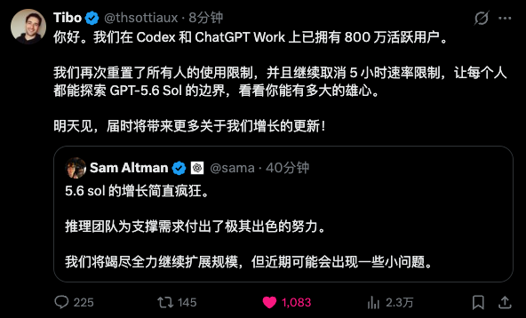
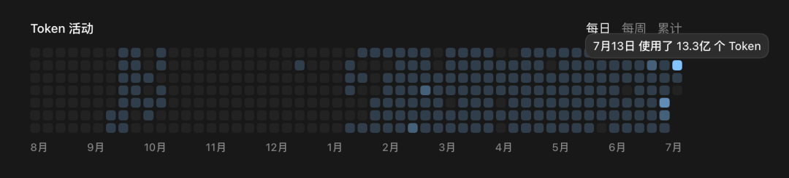
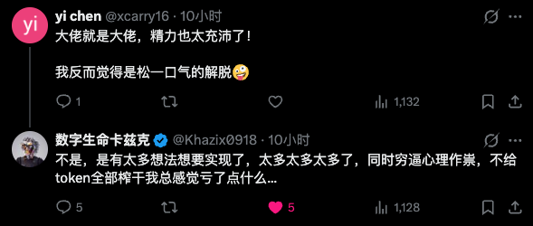
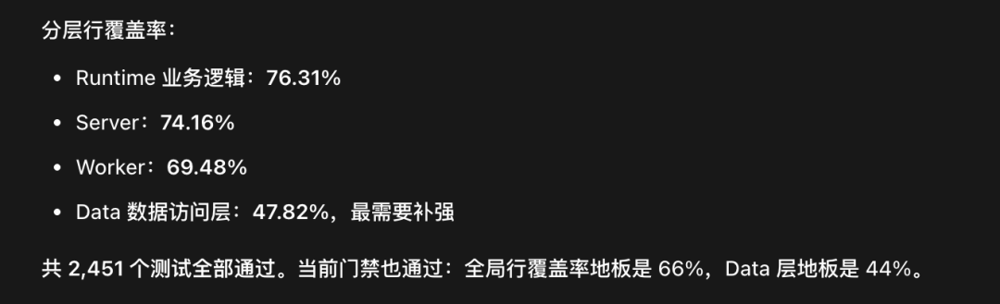
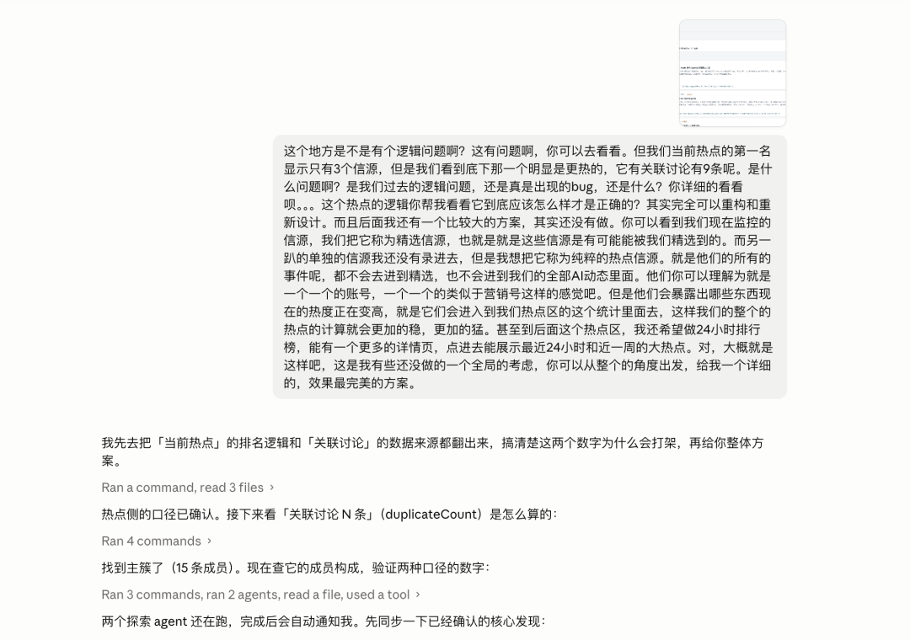
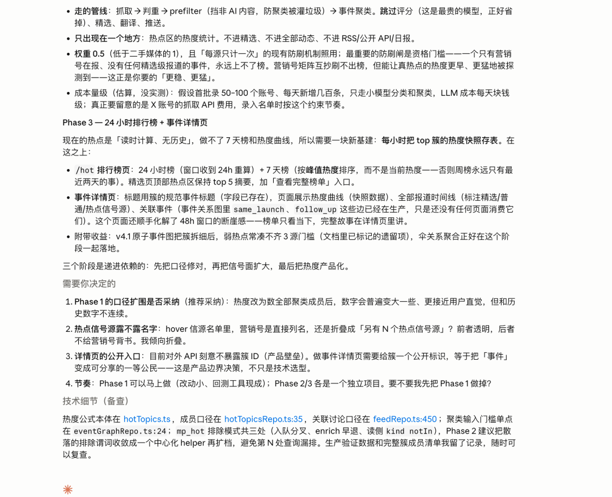
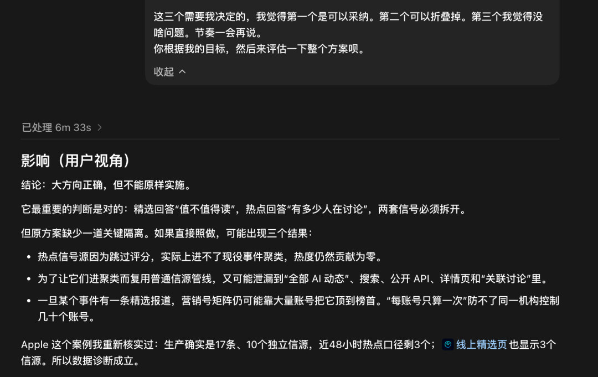
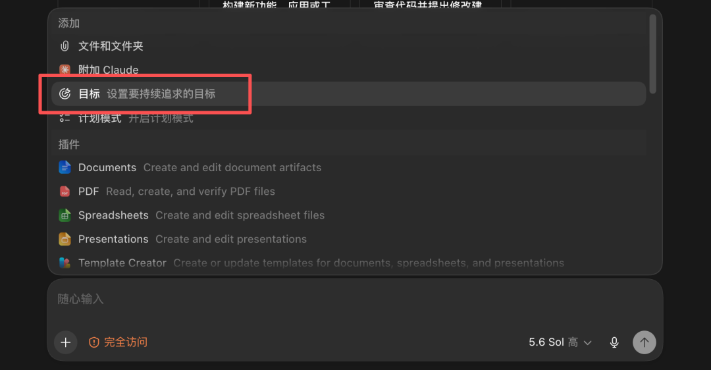
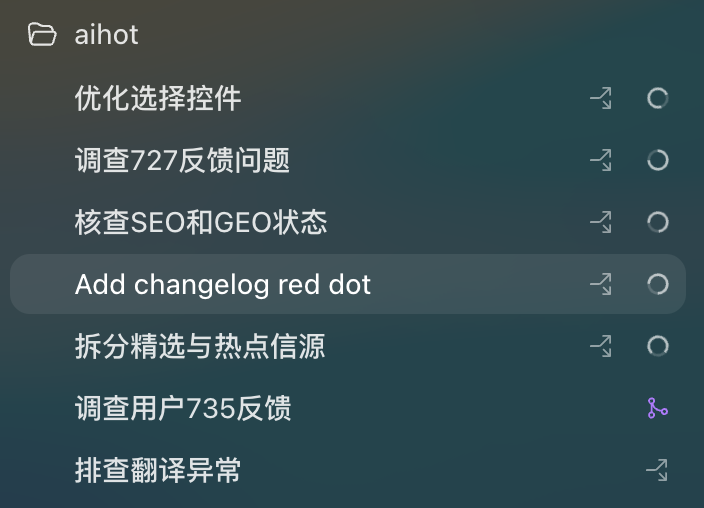

# [平均每天 Vibe Coding 16 小时后，这是我觉得 Fable 5 和 GPT-5.6 时代最好用的 AI 开发流程](https://mp.weixin.qq.com/s/wm_LM83gyLM-auidBxprZw)

最近两周，因为 Claude Fable 5 回归、GPT-5.6 上线，再加上 Tibo 义父疯狂的重置——

以及 AIHOT 月活用户，最近也正式突破了 50 万。

所以导致，我现在每天 Vibe Coding 的时间，几乎惊人地达到了 16 个小时。

我现在每天 Vibe Coding 到早上 6、7 点，然后睡一觉到中午 12 点起床收菜，再去公司，路上用 UU 远程 + Codex 继续 Coding。

我几乎不会让 AI 闲着。它们闲着的每一秒、我用不完的每一个 token，都感觉是对 Tibo 义父的不尊重。

每天真的就是不眠不休，感觉自己染上了 Coding 的瘾——主要还是创造和学习知识的快感，实在是太爽了。

昨天回复一个人的评论，我还是这么回复的：

那种爽感我一直不知道怎么描述。直到前天打车去机场，时间感觉要赶不上的时候，我跟司机说："求求你快点。" 然后司机一脚油门，那一瞬间，我知道该怎么形容这种爽感了。

**这是一种属于时代的推背感。** 它在不断推着你向前、向前、再向前。

---

而因为 Claude Fable 5 和 GPT-5.6 Sol 在智力和执行上的飞跃，我跟 Agent 协同开发的流程相比于 Opus 4.8 时代，也有了比较大的转变。

## 测试流程：把瓶颈从"写代码"转移到"验证"

前期我把巨量的 Token 都消耗在了一个地方：优化我的整体测试流程上。

在 Vibe Coding 中，开发的流程已经被大幅加速，写代码已经不再是瓶颈了，瓶颈转移到了测试、验证，还有你对方案的评审上。测试覆盖率目前做到了还算是比较舒服的区间。

因为现在高频提交、Agent 自动开 PR、反复跑测试的开发方式，为了节省测试和部署的时间，我甚至单独去腾讯云上搞了一台便宜的服务器来做 CI（没用 GitHub 的托管 Runner）。

> 这里可以提一句：其实 Vibe Coding 到后面，当你项目越来越大的时候，像 Codex 所谓的"1.5 倍快速模式"有的时候并不快，开着没啥意义。因为大量的时间都消耗在了确定性测试流程上——Agent 提测，测试要大概 5 分钟，然后被测试打回，修复，继续提测，又是 5 分钟。整体缩短的时间其实相当有限。

整体测试流程优化得差不多了之后，你会发现，你的想法终于可以肆意地挥洒了——因为你大概率无需担心实现不了或者出现 BUG，只要你能提出来，那大概率能稳定且完美地实现。

## 方案设计：Fable 5 出初版，GPT-5.6 纠错优化

那最大的难点就来了：前期如何设计你的方案？如何自动化地交给 Agent 进行开发？这两周跟这两顶级模型协同下来，我觉得最好的流程就是：

> **Claude Fable 5 做研究、出方案初版 → GPT-5.6 Sol 纠错和优化 → Codex 目标模式全自动化执行**

之后，你就可以放手去睡觉，等着起床收菜就行了。大道至简，重剑无锋，你根本不需要什么奇奇怪怪的技巧，直接说话就行。

## 举个新鲜的例子：AIHOT 热点功能重构

还是我的 AIHOT。最近在史诗级强化了防御、优化了 Agent 接入机制、上线了 UI 2.0、解决了用户收不到 Skill 更新通知的问题、大幅重置了详情页、更新了精选算法、优化了聚簇的算法……之后，我又想把之前一直想做的一个新功能给大幅重构和加强了。

就是**全网 AI 热点**，也就是现在"当前热点"那个位置。

判断什么东西很热，是一个很有意思的话题。我对它的理解特别简单，就两个指标：

1. **有多少人正在讨论它**
2. **它的数据趋势怎么样**

这两者合并，基本就能看出一个事件的热点程度了。所以，我想用这个机制来做一个功能，去抓取整个互联网（可能上万个以上的信源），来找到并监控 AI 行业真正正在爆发的热点。

### 第一步：Fable 5 出方案

我把这一通需求，第一步先发送给了 Claude Fable 5，让它给我出一个方案。

你相信我，在如今这个时代，Claude Fable 5 在做方案的初版设计上，在先进程度和优雅程度上，就是当世独一档。在大概 20 分钟之后，这个方案出来了。

但是注意，这个方案是不能直接用的——因为 Claude 家族一向的特性，就是丢东西，不细致也不细心。

### 第二步：GPT-5.6 审查纠错

把我们的需求和 Claude Fable 5 的方案，直接复制粘贴给 Codex，选中模型为 GPT-5.6 Sol 极高，然后说："这是隔壁同事做的，你详细审查一下。"

GPT-5.6 Sol 经常能挑出 Claude Fable 5 方案的问题，而且是比较严重的问题。比如这一次，它花了 6 分钟，找到了原有方案里一个非常关键的隔离问题，甚至会影响我们其他的流程管线和架构。

### 第三步：Codex 目标模式全自动执行

在 Codex 中，点击左下角的加号，会发现有一个模式，叫**目标模式**——Codex 会一直跑一直跑，不达到你的目标不罢休。

我自己最长的目标，就是前天跑过 17 个小时的，从早上 6 点睡觉之前挂机，一直跑到第二天凌晨才跑完。

这一次，我也设定了一下目标，其实就一句话：

> "根据上面所述的方案进行开发，保证没有任何错误，然后合并部署上线。"

有一说一，Codex 的目标模式做得真的比 Claude Code 的效果要好。可能是因为 GPT 系列一直以来幻觉率极低，Prompt 遵从效果也好，所以超长程任务几乎都不会变形。

## 我的全流程

1. 我发任务
2. Agent 理解并核实问题
3. 新建独立分支和工作区
4. 开发修改
5. 自动测试，必要时回测或检查页面
6. 推送分支并创建 PR
7. CI 自动验收
8. 合并到主分支
9. 部署上线
10. 检查真实线上效果
11. 使用洁癖.skill 同步代码、文档和 Agent 记忆，并复盘经验
12. 向我汇报最终结果
13. 等我确认没有问题
14. 清理开发分支、工作区和临时数据库
15. 任务结束

我自己感觉 6～7 个任务并行几乎就是我注意力的极限了。**我自己，就是 Agent 最大的那个瓶颈。**

## 总结：Vibe Coding 的核心流程

核心其实就是个**哑铃形状**：

- **左边**：用最牛逼的模型出方案、优化方案，然后执行
- **右边**：最重要的测试和研究流程，用洁癖.skill 保证文档、规则、记忆、代码四端统一

当你完成了这套流程的搭建之后——相信我，你绝壁会体验到 Vibe Coding 的爽感的。

那是一种，广阔无垠的创造力。那是一种，自由探索未知的奇妙。那是一种，来自 AI 时代的疯狂推背感。

**去创造吧。**

---

> 以上，既然看到这里了，如果觉得不错，随手点个赞、在看、转发三连吧。如果想第一时间收到推送，也可以给我个星标 ⭐，谢谢你看我的文章，我们，下次再见。

> 作者：卡兹克
> 投稿或爆料，请联系邮箱：wzglyay@virxact.com