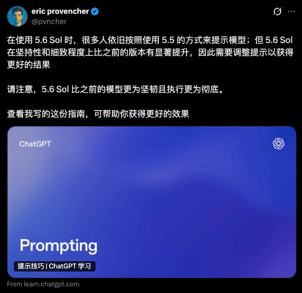
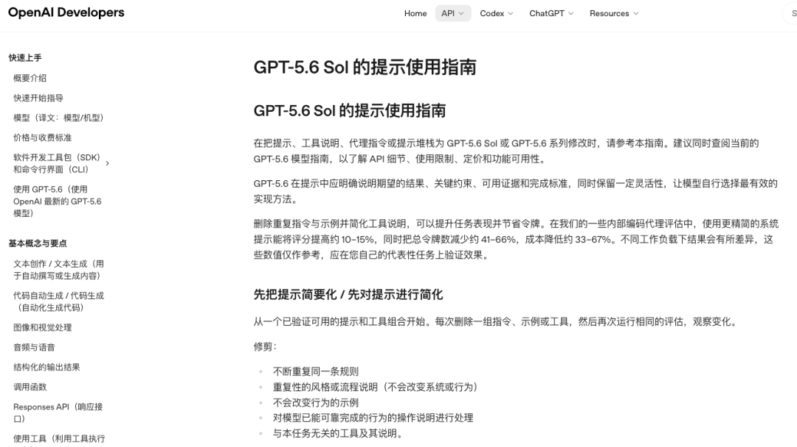

# [重磅！OpenAI 官方 Prompt 指南发布](https://mp.weixin.qq.com/s/lSvGH3nCK9oWf8wOyeCTGA)

Datawhale干货

### 作者：Eric Provencher，OpenAI 团队

OpenAI 最新发布了一份面向 GPT-5.6 的官方 Prompt 指南。它不仅能让你的 Agent 更能干，也能直接帮你省 Token！

官方指南全文：https://developers.openai.com/api/docs/guides/prompt-guidance-gpt-5p6

如果你正在用 GPT-5.6 开发应用或搭建 Agent，这份指南解决的是一个非常现实的问题：模型越来越强，Prompt 却越写越长。旧模型留下的补丁、重复规则，以及层层叠加的工具和权限说明，不仅持续消耗 Token，还可能互相冲突，反而让新模型发挥不出来。

在 OpenAI 的一组内部 Coding Agent 任务中，更精简的 System Prompt 让评分提高了约 **10%～15%**，同时将总 Token 减少了 **41%～66%**，成本降低了 **33%～67%**。

这位是指南的作者，Eric Provencher：

他目前在 OpenAI 做 **Codex 开发者体验（DX）**，此前打造过 **RepoPrompt**，长期折腾的正是代码库上下文、Prompt 设计和 Agent 工作流。

---

## 这份指南到底讲了什么？先给 Prompt 做减法！

这份指南首先建议开发者重新检查现有 Prompt，而不是直接增加新规则。

很多 System Prompt 都是在长期迭代中逐渐变长的。模型漏掉过一个步骤，就增加一条 `MUST`；工具调用出过一次问题，就补上一条 `NEVER`。模型更新之后，这些为旧版本添加的规则往往还会继续保留。时间一长，重复、过时甚至互相矛盾的指令就会越来越多。

OpenAI 建议从一套已经能够正常工作的 Prompt 和工具集开始，每次只删除一组重复指令、无效示例或无关工具，再用同一批评测检查结果。这样既能控制改动范围，也能判断具体是哪项修改影响了模型表现。

需要删除的是那些已经不再影响模型行为、却仍在消耗上下文的内容。需要保留的则是任务目标、成功标准、权限边界、证据要求和交付前的验证方式。

> Prompt 做减法，删的是无效信息，不是必要要求。

### 比起规定模型的每一步，更重要的是写清最终结果

指南的另一个重点，是减少不必要的过程指令。

过去的 Prompt 经常会规定模型先搜索、再读取文件、接着调用工具，最后按照固定顺序输出。但对于 GPT-5.6，OpenAI 更建议开发者写清最终目标、可用证据、行动边界和验收标准，让模型根据任务情况选择执行路径。

这并不意味着 `ALWAYS`、`NEVER`、`MUST` 不能使用。安全限制、必填字段和禁止执行的操作，仍然需要明确说明。但是否继续搜索、何时调用工具、信息不足时是否追问，通常更适合提供判断标准，而不是固定成一套适用于所有情况的流程。

停止条件也需要提前写清。证据已经足够时，模型应该进入交付；如果仍缺少关键事实，就说明缺少什么，并选择成本较低的方式补充。这样可以减少重复搜索和无效的 Token 消耗。

### 让 Agent 做事之前，先明确它可以做什么

当 Agent 接入工具后，Prompt 还需要说明任务授权的范围。

如果用户要求分析、审查或制定计划，通常只表示模型可以检查材料并报告结论；如果用户要求修改、构建或修复，才表示模型可以执行范围内的本地变更和非破坏性验证。涉及外部写入、删除、购买或明显扩大任务范围的操作，则应该再次确认。

> 能够判断下一步该做什么，不代表已经获得执行这一步的权限。

工具也应当按任务需要提供。工具描述需要说明它的用途、适用时机、关键返回字段以及失败后的处理方式。工具数量过多或说明不清，都会增加模型选择工具时的负担。

检索同样需要设置范围和停止条件。普通问答可以先进行一次范围较广的搜索，获得核心证据后直接回答；只有缺少关键事实、日期、来源或必要引用时，再进行有针对性的补充检索。没有搜到某项信息，不应直接推断这项信息不存在；来源相互冲突时，也应该如实说明。

### 长任务要及时更新状态，也要控制推理成本

对于持续时间较长、工具调用较多的任务，指南建议只在重要阶段发生变化时更新进度，不必向用户逐次说明常规工具调用。上下文压缩适合放在关键里程碑之后；之前保存的推理，也只有在目标、假设和优先级仍然有效时才应该继续使用。

Reasoning Effort 也不是越高越好。官方建议先保留当前设置作为基线，再测试相同档位和更低档位。只有评测结果证明 `high` 或 `xhigh` 确实带来收益，才有必要承担更高的推理成本；`max` 更适合难度最高、质量优先的任务。

在提高推理强度之前，还应该先检查 Prompt 是否写清了成功标准、依赖关系、工具使用条件和验证要求。如果这些信息不明确，单纯提高 Reasoning Effort 未必能解决问题。

### 生成结果之后，还需要验证

指南反复强调的一项原则是：**模型生成了结果，不代表任务已经完成。**

代码修改完成后，如果条件允许，应继续运行测试、类型检查、Lint、构建检查或最小冒烟测试。前端和视觉任务也需要查看实际渲染结果，检查布局、裁切、间距和内容是否完整。

如果当前环境无法完成验证，也应该说明原因，并给出下一步的检查方法，而不是直接把结果表述为已经完成。

指南最后还提供了一套 Prompt 结构，包括 `Role`、`Personality`、`Goal`、`Success criteria`、`Constraints`、`Tools`、`Output` 和 `Stop rules`。这套结构并不是要求开发者把每一项都写得很长，而是帮助他们确认 Prompt 中的每条信息是否真的会影响模型行为。

> 只有确实会影响模型行为的信息，才有必要写进 Prompt。

---

## 谁最值得看，怎么读最省时间

这份指南最适合正在迁移 GPT-5.6 的开发者，以及维护复杂 System Prompt、工具描述、Agent 指令和 Prompt Stack 的团队。

如果你的 Prompt 中已经积累了大量 `Always`、`Never`、旧模型补丁和固定流程，或者你的应用涉及搜索、工具调用、代码修改、外部操作和长任务状态，这份指南尤其值得完整阅读。

如果你只是使用 ChatGPT 进行普通问答、写作和总结，则不必逐节阅读。理解**"先做减法、结果优先、明确边界、完成前验证"**这几个核心判断，基本就能抓住整份指南的主线。

时间有限的话，可以优先阅读官方原文中的 **Simplify prompts first**、**Outcome-first prompts and stopping conditions**、**Suggested prompt structure** 和 **Prompt migration workflow**。前两部分帮助你判断 Prompt 应该删什么、保留什么，后两部分则可以直接用于整理现有 Prompt 和制定迁移步骤。

> 官方指南全文：https://developers.openai.com/api/docs/guides/prompt-guidance-gpt-5p6

 **一起"点赞"三连** ↓